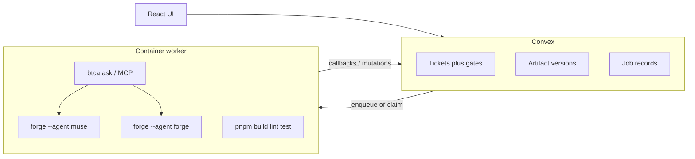

# Ticket AI Workflow — Phased Implementation Plan

## Current baseline

- Tickets live in Convex [`convex/schema.ts`](convex/schema.ts) with coarse statuses `BACKLOG → TEST_CASE → PLANNING → CODE_GENERATION → COMPLETED`.
- [`convex/tickets.ts`](convex/tickets.ts) exposes `move`, which advances or rewinds **without** approval gates, artifact storage, or jobs—this must be replaced or superseded.
- No actions, no HTTP routes beyond auth ([`convex/http.ts`](convex/http.ts)), no ForgeCode/BTCA integration yet.

## Target architecture

**Split of responsibilities**

| Concern | Where | Why |
|--------|--------|-----|
| Workflow rules, approvals, versioning, auth | Convex mutations/queries | Single source of truth, [`assertProjectAccess`](convex/utils/projectAccess.ts) already exists |
| Long-running ForgeCode, git, Docker, BTCA CLI | **External worker** (one container per job or pooled workers) | Convex actions are short-lived and cannot host Docker; generated commands need isolation |
| PR creation (post-validation) | Worker + Git provider API | Same isolation and secrets as codegen |

---

## Open product choices (defaults suggested)

- **AC generator**: same worker + structured LLM via Forge (`muse` with strict "output only Gherkin-style AC" prompt) *or* direct LLM API for speed; default to **Forge in container** for one toolchain.
- **PR host**: GitHub App vs PAT—plan assumes **GitHub** first; abstract `GitProvider` in worker if you need GitLab later.

---
---

# Phase 1 — Schema & Workflow Engine ✅ COMPLETE

> **Goal**: Lay the backend foundation — new tables, strict state machine, gate logic. No UI changes, no jobs yet.

> [!NOTE]
> **This phase is fully implemented.** Both `convex/schema.ts` and `convex/workflowEngine.ts` already reflect everything described below. Several items originally deferred to Phase 2 (artifact schema finalization) and Phase 3 (asyncJobs schema finalization) were implemented eagerly — see callouts per item.

### Scope

1. **Extend [`convex/schema.ts`](convex/schema.ts)** — ✅ Done:
   - Git fields on `projects`: `gitRemoteUrl`, `defaultBranch`, `btcaProjectId` — all optional strings — are live.
   - **`artifacts`** table — simplified schema: `ticketId`, `type` (`"AC" | "PLAN" | "CODE"`), `content`, `status` (`"draft" | "approved"`), `userPrompt?`, `createdByJobId?`. No `version`, no `parentArtifactId`. Exactly one row per `(ticketId, type)`. Indexes: `by_ticketId`, `by_ticketId_and_type`. *(The "finalize in Phase 2" step is pre-done.)*
   - **`asyncJobs`** table — full schema is already defined (not a stub): `ticketId`, `projectId`, `type` (includes `CREATE_PR`), `status`, `attempt`, `args`, `result?`, `error?`, `idempotencyKey`, `artifactId?`, `startedAt?`, `finishedAt?`. Indexes: `by_status`, `by_ticketId`, `by_projectId`, `by_idempotencyKey`. *(The "finalize in Phase 3" step is pre-done.)*
   - **No separate gate table** — gate state is derived on-the-fly by querying `artifacts` (and later `validationRuns`).

2. **[`convex/workflowEngine.ts`](convex/workflowEngine.ts)** — ✅ Done (real queries, not stubs):
   - `GATED_PHASES` map (`TEST_CASE→AC`, `PLANNING→PLAN`, `CODE_GENERATION→CODE`) + `ARTIFACT_LABELS` for error messages.
   - `canAdvance(ctx, ticketId, currentPhase, targetPhase)` — enforces forward-only single-step moves; queries `artifacts` with `by_ticketId_and_type` + `.unique()` (one artifact per type guaranteed). Produces distinct messages: "No X exists" vs "X is draft". *(The "real artifact queries" step from Phase 2 is pre-done.)*
   - `CODE_GENERATION → COMPLETED` validation-run check is stubbed with a `// TODO Phase 8` comment (correct).
   - `advancePhase({ ticketId, to })` — authenticates via `getAuthUserId`, authorizes via `assertProjectAccess`, calls `canAdvance`, patches ticket `status`.
   - `rewindPhase({ ticketId, to })` — authenticates + authorizes identically, validates the target is strictly backward (`targetIndex < currentIndex`), patches ticket `status`. **Does not delete downstream artifact versions** — re-entry into a phase with existing approved artifacts is intentionally allowed.

3. **[`convex/tickets.ts`](convex/tickets.ts) `move`** — still present, backwards-compatible. Can be narrowed or deprecated in a follow-up.

### Key files

| Action | File | Status |
|--------|------|--------|
| MODIFY | [`convex/schema.ts`](convex/schema.ts) | ✅ Done |
| NEW    | [`convex/workflowEngine.ts`](convex/workflowEngine.ts) | ✅ Done |
| MODIFY | [`convex/tickets.ts`](convex/tickets.ts) — narrow `move` | ⏭ Deferred (still works as-is) |

### How to test

1. `npx convex dev` — schema deploys successfully (all three new tables + updated `projects`).
2. In the Convex dashboard, create a ticket → verify it starts in `BACKLOG`.
3. Call `advancePhase` with `to: "TEST_CASE"` → succeeds.
4. Call `advancePhase` with `to: "PLANNING"` → **fails** with `"Cannot advance: acceptance criteria must be approved first"`.
5. Call `rewindPhase` with `to: "BACKLOG"` → succeeds, ticket goes back.
6. Existing `move` mutation still works for backwards compatibility.

---

# Phase 2 — Artifact Versioning & Approval ✅ COMPLETE

> **Goal**: Full CRUD for artifact versions, approval mutations, and gate integration so `advancePhase` actually unblocks when artifacts are approved.

> [!NOTE]
> **This phase is fully implemented.** The `artifacts` schema and `workflowEngine.ts` gate queries were pre-done in Phase 1. The only new deliverable this phase is `convex/artifacts.ts`.

### Scope

1. **Finalize `artifacts` table schema** — ✅ Pre-done in Phase 1 (simplified further post-implementation):
   - Fields: `ticketId`, `type` (`"AC" | "PLAN" | "CODE"`), `content`, `status` (`"draft" | "approved"`), `userPrompt?`, `createdByJobId?`.
   - No `version` or `parentArtifactId` — one row per `(ticketId, type)`.
   - Indexes: `by_ticketId_and_type`, `by_ticketId`.

2. **[`convex/artifacts.ts`](convex/artifacts.ts)** — ✅ Done:
   - `upsertArtifact({ ticketId, type, content, userPrompt? })` — authenticates + `assertProjectAccess`, enforces phase-to-type constraint (`TEST_CASE→AC` etc.), upserts: patches existing row (resets to `"draft"`) or inserts new. Returns `Id<"artifacts">`.
   - `approveArtifact({ artifactId })` — patches `status: "approved"`. `canAdvance` picks this up via `.unique()` — no gate table to sync.
   - `unapproveArtifact({ artifactId })` — resets `status: "draft"`, re-locking the phase gate without discarding content.
   - `getTicketArtifacts({ ticketId })` — non-throwing access check (returns `[]` on unauthorised); returns all artifacts for the ticket (max 3 rows). Uses `.collect()`.
   - `getArtifact({ artifactId })` — non-throwing access check (returns `null`); single `ctx.db.get`.

3. **Wire gates into `workflowEngine.ts`** — ✅ Pre-done in Phase 1 (real queries, not stubs).

### Key files

| Action | File | Status |
|--------|------|--------|
| MODIFY | [`convex/schema.ts`](convex/schema.ts) — finalize `artifacts` | ✅ Pre-done (Phase 1) |
| NEW    | [`convex/artifacts.ts`](convex/artifacts.ts) | ✅ Done |
| MODIFY | [`convex/workflowEngine.ts`](convex/workflowEngine.ts) — real artifact queries | ✅ Pre-done (Phase 1) |

### How to test

1. Create a ticket, advance to `TEST_CASE`.
2. Call `upsertArtifact({ ticketId, type: "AC", content: "## Given..." })` → row created with `status: "draft"`.
3. Call `upsertArtifact` again with different content → same row overwritten, status still `"draft"`.
4. Call `advancePhase({ to: "PLANNING" })` → **still fails** (`"Acceptance Criteria is draft"`).
5. Call `approveArtifact({ artifactId })` → status is `"approved"`.
6. Call `advancePhase({ to: "PLANNING" })` → **succeeds**.
7. Call `unapproveArtifact({ artifactId })` → status resets to `"draft"`, gate locks again.
8. Call `advancePhase({ to: "PLANNING" })` → **fails** again.

---

# Phase 3 — Async Job Infrastructure + Secured HTTP

> **Goal**: Job queue system in Convex + secured HTTP callback endpoints so an external worker can claim jobs and report results. No actual worker yet — test with `curl` / Convex dashboard.

### Scope

1. **Finalize `asyncJobs` table schema** (from Phase 1 stub — already in schema):
   - Fields: `ticketId`, `projectId`, `type` (`"GENERATE_AC" | "GENERATE_PLAN" | "GENERATE_CODE" | "VALIDATE" | "FIX_AFTER_FAILURE" | "CREATE_PR"`), `status` (`"queued" | "running" | "succeeded" | "failed" | "cancelled"`), `attempt` (number), `args` (object — flexible per job type), `result` (optional object), `error` (optional string), `artifactId` (optional — links to the artifact row created/updated by this job), `idempotencyKey` (string), `startedAt` / `finishedAt` (optional numbers).
   - *Note: Extracted `jobType` unified array validation to schema to share dynamically across files.*
   - Indexes: `by_status`, `by_ticketId`, `by_projectId`, `by_idempotencyKey`.

2. **New module [`convex/jobs.ts`](convex/jobs.ts)**:
   - Public mutation `enqueueJob({ ticketId, type, args, idempotencyKey? })` — inserts job with `status: "queued"`, validates no duplicate via idempotency key.
   - **Internal** mutation `claimNextJob({ type? })` — transaction: finds oldest `queued` job (optionally filtered by type), patches to `running`, returns full payload. Only callable internally.
   - **Internal** mutation `completeJob({ jobId, status, result?, error? })` — **(Guard Clause: instantly rejects redundant hits if job status is not strictly `"running"`)** patches job, handles side effects (dynamically resolving `jobType` to `artifactType` mapping, automatically patching `artifacts` table if result contains content, linking `createdByJobId` and `artifactId`).
   - Public query `listJobs({ ticketId })` — for UI progress display.
   - Public mutation `cancelJob({ jobId })` — sets `cancelled` if still `queued` or `running`.

3. **Mutation `requestRegeneration` in [`convex/workflowEngine.ts`](convex/workflowEngine.ts)**:
   - `requestRegeneration({ ticketId, phase, userPrompt })` — validates phase matches ticket status, verifies no running job prevents this flow in queue, dynamically patches userPrompt args and safely inserts a `status: "queued"` row independently (avoids mutation recursion block).

4. **Secured HTTP routes in [`convex/http.ts`](convex/http.ts)**:
   - `POST /worker/claim` → calls `claimNextJob` (validates HMAC or shared secret from `Authorization` header).
   - `POST /worker/complete` → calls `completeJob` (same auth).
   - Auth: use a `WORKER_SECRET` environment variable, worker sends it as `Bearer` token, HTTP action validates before calling internal mutations.

### Key files

| Action | File |
|--------|------|
| MODIFY | [`convex/schema.ts`](convex/schema.ts) — finalize `asyncJobs` |
| NEW    | [`convex/jobs.ts`](convex/jobs.ts) |
| MODIFY | [`convex/workflowEngine.ts`](convex/workflowEngine.ts) — `requestRegeneration` |
| MODIFY | [`convex/http.ts`](convex/http.ts) — worker callback routes |

### Edge & Happy Path Test Cases

**1. `enqueueJob` (Public Mutation)**
- **Happy Path:** Enqueue a job successfully → Job row created with `status: "queued"`, `attempt` 0.
- **Idempotency Edge Case:** Call `enqueueJob` again with same `idempotencyKey` → Rejected, no duplicate row created; returns existing job ID.
- **Authorization Edge Case:** Call `enqueueJob` without project access → Throws unauthorized error.

**2. `claimNextJob` & `/worker/claim` (HTTP Endpoint)**
- **Happy Path:** `POST /worker/claim` → Worker claims oldest "queued" job. Job `status` becomes "running", `attempt` increments, `startedAt` sets.
- **Empty Queue Edge Case:** `POST /worker/claim` when no jobs exist → Immediately returns `204 No Content` (doesn't hang).
- **Concurrency Edge Case:** Two workers call `POST /worker/claim` simultaneously → Convex transaction handles atomic dispatch; no duplicate claims.
- **Data Structuring Edge Case:** Call `/worker/claim` with invalid custom args JSON string format → Endpoint returns `400 Bad Request`.
- **Authorization Edge Case:** Call `/worker/claim` with a missing or incorrect `WORKER_SECRET` header → Returns `401 Unauthorized`.

**3. `completeJob` & `/worker/complete` (HTTP Endpoint)**
- **Happy Path (with Content):** `POST /worker/complete` with `status: "succeeded"` + artifact `content`. Job finishes AND `artifacts` table properly updates/inserts `status: "draft"` linking `createdByJobId`.
- **Happy Path (no Content):** `POST /worker/complete` without content (i.e. validation). Job completes but no `artifacts` side-effect executes.
- **Failure Edge Case:** `POST /worker/complete` with `status: "failed"` and an `error` body. Job finishes saving the error state.
- **Missing Payload Edge Case:** Missing `jobId` or `status` arg → Endpoint returns `400 Bad Request`.

**4. `cancelJob` (Public Mutation)**
- **Happy Path:** Cancel a "queued" or "running" job → status changes instantly to `"cancelled"`.
- **State Violation Edge Case:** Cancel a job already "succeeded", "failed", or "cancelled" → Throws an error preventing operation.

**5. `requestRegeneration` (Public Mutation at `workflowEngine`)**
- **Happy Path:** Target ticket is correctly in the Phase `TEST_CASE`. Executes successfully queueing a `GENERATE_AC` job.
- **State Violation Edge Case:** Try to regenerate a ticket currently in `BACKLOG` → Throws "Ticket is currently in BACKLOG". 
- **Concurrency Block Edge Case:** User hits regenerate while another `GENERATE_AC` job is already queued/running for the same phase/ticket → Throws "A GENERATE_AC job is already queued".

---

# Phase 4 - Basic Ticket Detail UI COMPLETE

> **Goal**: Provide a dedicated ticket detail page with phase controls, artifact review/actions, and live job visibility. This phase is UI-only and depends on the backend mutations/queries from Phases 1-3.

### Scope

1. **Route + page shell** - Implemented at `/projects/:projectId/tickets/:ticketId`:
   - [`src/App.tsx`](src/App.tsx) registers the route.
   - [`src/pages/TicketDetailPage.tsx`](src/pages/TicketDetailPage.tsx) loads the project and ticket, defaults the selected phase to the ticket's active phase, and renders a 3-column layout:
     - left: phase rail
     - center: artifact panel
     - right: job status panel

2. **Phase rail** - Implemented in [`src/components/tickets/PhaseRail.tsx`](src/components/tickets/PhaseRail.tsx):
   - Vertical stepper for all `TICKET_STATUSES`.
   - Current phase, completed phases, and locked gated phases are visually distinct.
   - Reads artifacts via `getTicketArtifacts({ ticketId })` to determine whether the current gate is locked.
   - **Advance** calls `advancePhase`, is disabled when the current gate is locked, and shows a tooltip.
   - **Rewind** calls `rewindPhase` with a confirmation dialog.
   - Selecting a phase in the rail changes the artifact shown in the center panel.

3. **Artifact panel** - Implemented in [`src/components/tickets/ArtifactPanel.tsx`](src/components/tickets/ArtifactPanel.tsx):
   - Maps phases to a single expected artifact type (`AC`, `PLAN`, `CODE`).
   - Shows a "No Artifact Required" empty state for non-artifact phases like `BACKLOG` and `COMPLETED`.
   - Displays artifact content in a preserved plain-text/code-style block, not markdown rendering.
   - Shows the artifact status badge (`draft` / `approved`).
   - **Approve Document** calls `approveArtifact`.
   - **Revoke Approval** calls `unapproveArtifact`.
   - **Regenerate** is an inline textarea + button in the footer, not a modal; it calls `requestRegeneration({ ticketId, phase, userPrompt })`.
   - If no artifact exists yet for the selected phase, the panel shows a waiting state. If the selected phase is also the current ticket phase, that waiting state shows a spinner.

4. **Job status panel** - Implemented in [`src/components/tickets/JobStatusPanel.tsx`](src/components/tickets/JobStatusPanel.tsx):
   - Uses `listJobs({ ticketId })` for live-updating ticket job history.
   - Status badges are color-coded for queued, running, succeeded, failed, and cancelled.
   - Failed jobs expose expandable error details.
   - Successful jobs show a small result preview when `result.content` exists.

5. **Navigation** - Implemented:
   - Ticket detail navigation is wired from [`src/components/tickets/TicketRow.tsx`](src/components/tickets/TicketRow.tsx), which links each row to `/projects/${ticket.projectId}/tickets/${ticket._id}`.
   - [`src/pages/ProjectWorkspacePage.tsx`](src/pages/ProjectWorkspacePage.tsx) renders those rows.

### Key files

| Action | File | Status |
|--------|------|--------|
| NEW    | [`src/pages/TicketDetailPage.tsx`](src/pages/TicketDetailPage.tsx) | Done |
| NEW    | [`src/components/tickets/PhaseRail.tsx`](src/components/tickets/PhaseRail.tsx) | Done |
| NEW    | [`src/components/tickets/ArtifactPanel.tsx`](src/components/tickets/ArtifactPanel.tsx) | Done |
| NEW    | [`src/components/tickets/JobStatusPanel.tsx`](src/components/tickets/JobStatusPanel.tsx) | Done |
| MODIFY | [`src/App.tsx`](src/App.tsx) | Done |
| MODIFY | [`src/components/tickets/TicketRow.tsx`](src/components/tickets/TicketRow.tsx) | Done |
| MODIFY | [`src/pages/ProjectWorkspacePage.tsx`](src/pages/ProjectWorkspacePage.tsx) | Indirectly wired via `TicketRow` |

### How to test

1. Navigate to `/projects/:projectId/tickets/:ticketId` -> the ticket detail page loads with the current phase selected.
2. Click different phases in the rail -> the center artifact panel updates to that phase.
3. Manually create or update an artifact via `upsertArtifact` -> the artifact appears in the panel as plain text.
4. Click **Approve Document** -> the artifact badge changes to approved and the current gate unlocks.
5. Click **Advance** -> the ticket moves forward and the rail updates.
6. Click **Regenerate** on the current phase with prompt text entered -> `requestRegeneration` queues a job and the job panel updates.
7. Click **Rewind** -> confirmation dialog appears; confirm to move back one phase.

---
# Phase 5 — Worker Container

> **Goal**: Build the external worker that polls Convex for jobs, runs ForgeCode/BTCA in a Docker container, and calls back with results. Test with a simple echo/mock job before wiring real AI.

### Scope

1. **New directory `worker/`** at repo root:
   - **`Dockerfile`**: base image (Debian/Ubuntu) + `git` + `curl` + Node.js + `pnpm` + [Bun](https://bun.sh) (BTCA requires it) + [`btca` CLI](https://docs.btca.dev/guides/quickstart) + [ForgeCode](https://forgecode.dev/docs/commands) install.
   - **`worker/src/index.ts`** (entrypoint, runs with Bun):
     - Job loop: `POST /worker/claim` → if job returned, process it → `POST /worker/complete`.
     - Configurable poll interval (e.g. 5s).
     - Graceful shutdown on SIGTERM.
   - **`worker/src/contextBundle.ts`**: builds a `ContextBundle` from job args — ticket fields, approved prior artifacts, BTCA Q&A pairs with **token budget** (truncate with explicit `[truncated]`).
   - **`worker/src/handlers/`**: one handler per job type (initially just a mock/echo handler for testing).

2. **Environment variables** the container needs:
   - `CONVEX_URL` — the deployment HTTP URL.
   - `WORKER_SECRET` — matches the Convex env var.
   - `ANTHROPIC_API_KEY` (or other provider keys) — for ForgeCode.
   - `BTCA_API_KEY` — if BTCA requires one.

3. **Non-interactive ForgeCode auth**: mount provider API keys via env vars; avoid `:login` in CI. Document `forge provider` non-interactive setup if available, else use pre-seeded config volume.

### Key files

| Action | File |
|--------|------|
| NEW    | `worker/Dockerfile` |
| NEW    | `worker/src/index.ts` |
| NEW    | `worker/src/contextBundle.ts` |
| NEW    | `worker/src/handlers/echo.ts` (mock handler for testing) |
| NEW    | `worker/package.json` |
| NEW    | `worker/.env.example` |

### How to test

1. `docker build -t synapse-worker ./worker` → builds successfully.
2. Enqueue a mock job in Convex dashboard (type: `"GENERATE_AC"`, or a test type).
3. `docker run --env-file worker/.env synapse-worker` → container starts, claims the job, runs echo handler, calls `/worker/complete`.
4. Verify in Convex dashboard: job status is `succeeded`, result contains echo data.
5. Stop container (Ctrl+C) → graceful shutdown, no orphaned jobs.
6. Test with wrong `WORKER_SECRET` → worker gets 401, logs error, retries with backoff.

---

# Phase 6 — AC Generation End-to-End (TEST_CASE Phase)

> **Goal**: Wire the first real AI phase — entering TEST_CASE triggers AC generation, the worker produces acceptance criteria via ForgeCode, and the user can view/approve/regenerate in the UI.

### Scope

1. **Auto-enqueue on phase entry**:
   - When `advancePhase` moves a ticket to `TEST_CASE`, auto-enqueue a `GENERATE_AC` job (idempotent — skip if one is already `queued`/`running` for this ticket+phase).

2. **Worker handler `worker/src/handlers/generateAC.ts`**:
   - Build bounded prompt from ticket title/description/type.
   - Call BTCA (`btca ask` against the indexed repo) for 1–3 focused questions (e.g. "modules likely touched", "existing test patterns") and inject **short** answers into the prompt — never full tree listings.
   - Run `forge --agent muse -p "..."` with strict system prompt: "Output only Gherkin-style acceptance criteria in markdown."
   - Parse output → call `/worker/complete` with content.

3. **`completeJob` side effect for `GENERATE_AC`**:
   - Calls `upsertArtifact({ ticketId, type: "AC", content, createdByJobId })` — overwrites any existing draft, resets to `"draft"` status.
   - No gate table to update — `canAdvance` queries the single artifact row via `.unique()`.

4. **Regenerate flow**:
   - User clicks "Regenerate" in UI → `requestRegeneration` enqueues new `GENERATE_AC` job with `userPrompt`.
   - Worker uses `userPrompt` as refinement context.
   - `completeJob` calls `upsertArtifact` — overwrites the existing artifact content in place, resets status to `"draft"`.

### Key files

| Action | File |
|--------|------|
| MODIFY | [`convex/workflowEngine.ts`](convex/workflowEngine.ts) — auto-enqueue on entry |
| MODIFY | [`convex/jobs.ts`](convex/jobs.ts) — `completeJob` side effects for AC |
| NEW    | `worker/src/handlers/generateAC.ts` |
| MODIFY | `worker/src/index.ts` — route `GENERATE_AC` to handler |

### How to test

1. Advance a ticket to `TEST_CASE` → job auto-enqueued (visible in UI job panel as "queued").
2. Worker claims and processes → job becomes "running" in UI.
3. Worker completes → artifact panel shows generated AC markdown with `status: "draft"` badge.
4. Click "Approve" → gate unlocks, "Advance to Planning" button enables.
5. Click "Regenerate" with prompt "Add edge cases for empty input" → new job enqueued → artifact content replaced with new version, status reset to `"draft"`.
6. Advance to PLANNING → succeeds.

---

# Phase 7 — Plan & Code Generation End-to-End

> **Goal**: Wire up PLANNING and CODE_GENERATION phases with the same pattern as Phase 6. Add the validation layer.

### Scope

#### 7A: Planning phase (`:muse`)

1. **Auto-enqueue `GENERATE_PLAN`** when entering `PLANNING`.
2. **Worker handler `worker/src/handlers/generatePlan.ts`**:
   - **Prompt pack**: ticket fields, **approved AC content** (fetched via `getArtifact({ ticketId, type: "AC" })`), user "extra context", and BTCA-grounded snippets (same bounded pattern as AC).
   - Run `forge --agent muse -p "..."`.
   - Capture muse output / `plans/` file, call `upsertArtifact` with `type: "PLAN"`.
3. **Approval gate** mirrors AC — approve plan before advancing to `CODE_GENERATION`.

#### 7B: Code generation phase (`:forge`)

1. **Auto-enqueue `GENERATE_CODE`** when entering `CODE_GENERATION` (approved plan content passed in job args).
2. **Worker handler `worker/src/handlers/generateCode.ts`**:
   - Clone or update shallow git checkout (project's `gitRemoteUrl`, `defaultBranch`).
   - Checkout disposable branch `synapse/ticket-<id>`.
   - Run `forge --agent forge -p "Implement the following plan: ..."` with plan text inlined.
   - System/developer instructions require: only changes consistent with the plan; list files touched; if plan is ambiguous, stop and note assumptions.
   - Call `upsertArtifact` with `type: "CODE"`, storing commit SHA + summary. Prefer git refs + small metadata in Convex over large blobs.

#### 7C: Validation layer

1. **Auto-enqueue `VALIDATE`** after each successful `GENERATE_CODE`.
2. **Worker handler `worker/src/handlers/validate.ts`**:
   - In the same container (or slimmer CI image) with the generated diff applied.
   - Run `pnpm install --frozen-lockfile`, `pnpm run build`, `pnpm run lint`, then `pnpm test`.
   - Persist `validationRuns` table: step statuses and log excerpts.
3. **New table `validationRuns`** in schema: `jobId`, `ticketId`, `steps` (array of `{ name, status, logExcerpt }`), `overallStatus` (`"PASSED" | "FAILED"`).

### Key files

| Action | File |
|--------|------|
| MODIFY | [`convex/schema.ts`](convex/schema.ts) — `validationRuns` table |
| MODIFY | [`convex/workflowEngine.ts`](convex/workflowEngine.ts) — auto-enqueue for PLANNING & CODE_GEN |
| MODIFY | [`convex/jobs.ts`](convex/jobs.ts) — side effects for PLAN & CODE |
| NEW    | [`convex/validationRuns.ts`](convex/validationRuns.ts) — queries for validation data |
| NEW    | `worker/src/handlers/generatePlan.ts` |
| NEW    | `worker/src/handlers/generateCode.ts` |
| NEW    | `worker/src/handlers/validate.ts` |

### How to test

**7A — Planning:**
1. With an approved AC, advance to `PLANNING` → `GENERATE_PLAN` job enqueued.
2. Worker produces plan → artifact version appears with plan markdown.
3. Approve plan → advance to `CODE_GENERATION` succeeds.

**7B — Code generation:**
1. Advance to `CODE_GENERATION` → `GENERATE_CODE` job enqueued.
2. Worker clones repo, runs forge, produces code → artifact version with commit SHA + summary.
3. Artifact panel shows code summary and changed files.

**7C — Validation:**
1. After code generation succeeds → `VALIDATE` job auto-enqueued.
2. Worker runs build/lint/test → `validationRuns` row created.
3. If `PASSED` → validation badge shows green in UI.
4. If `FAILED` → badge shows red with expandable log excerpts.

---

# Phase 8 — Fix-after-Failure & PR Creation

> **Goal**: Close the loop — auto-fix failed validations with retry cap, and enable PR creation when all gates pass.

### Scope

1. **Fix-after-failure**:
   - When `VALIDATE` job completes with `FAILED` → auto-enqueue `FIX_AFTER_FAILURE` job.
   - Handler: run `forge` with a prompt containing the failing command output (bounded/truncated).
   - After fix → auto-enqueue another `VALIDATE`.
   - **Retry cap**: store `attempt` on jobs, cap at 3 (configurable). After max retries, mark the latest `validationRuns` row with a `blockedReason` or patch the ticket with a `needsIntervention` flag.

2. **PR creation**:
   - New mutation `requestPR({ ticketId })` — validates: code artifact approved + latest validation `PASSED`.
   - Enqueues `CREATE_PR` job.
   - Worker handler `worker/src/handlers/createPR.ts`:
     - Push the disposable branch to remote.
     - Use GitHub API (PAT or GitHub App) to open a PR with auto-generated title/body (ticket title, AC summary, plan summary, validation status).
   - On success → store PR URL on ticket, transition to `COMPLETED`.

3. **UI additions**:
   - "Open PR" button on ticket detail page — enabled only when code approved + validation passed.
   - PR link displayed after creation.
   - Validation panel: shows run history, step-by-step results, fix attempts.

4. **`canAdvance` update for `CODE_GENERATION → COMPLETED`**:
   - Now requires latest `validationRuns.overallStatus === "PASSED"` (was stubbed in Phase 1).

### Key files

| Action | File |
|--------|------|
| MODIFY | [`convex/workflowEngine.ts`](convex/workflowEngine.ts) — `requestPR`, real validation gate |
| MODIFY | [`convex/jobs.ts`](convex/jobs.ts) — fix-after-failure auto-enqueue, retry cap |
| NEW    | `worker/src/handlers/fixAfterFailure.ts` |
| NEW    | `worker/src/handlers/createPR.ts` |
| MODIFY | `src/pages/TicketDetailPage.tsx` — PR button, validation panel |

### How to test

1. Trigger a code generation that produces code with a lint error → validation `FAILED`.
2. `FIX_AFTER_FAILURE` job auto-enqueued → worker attempts fix → re-validates.
3. If fixed → validation `PASSED`. If not → retries up to 3 times → then `blockedReason` set.
4. With passing validation, click "Open PR" → PR created on GitHub, link appears in UI.
5. Ticket transitions to `COMPLETED`.
6. Verify full lifecycle: `BACKLOG → TEST_CASE (AC) → PLANNING (plan) → CODE_GENERATION (code + validation) → COMPLETED (PR)`.

---

## Consistency & control (applies to all phases)

- Single workflow module + tests for `canAdvance` / `canEnqueue`.
- All AI steps are **job-driven** with stored prompts and outputs (audit trail).
- PR creation is a **separate** explicit mutation/worker step after validation, not bundled into `forge` success.
- **One job per container** (simplest security/reproducibility) or **ephemeral workspace** per job on a shared worker with strong uid/gid isolation.

## Context management (BTCA + caps — applies to Phases 5–8)

- **Project settings**: link to git remote; optional BTCA project/repo id; "default questions" template.
- **Orchestrator** (worker TypeScript) builds a `ContextBundle`: ticket, approved prior artifacts by id, BTCA Q&A pairs with **token/size budget** (truncate with explicit `[truncated]`).
- **Never** pass full repo: rely on BTCA + plan file + diff summaries.

## Container image shape (Phase 5+)

- Base: Debian/Ubuntu + `git` + `curl` + [Forge install](https://forgecode.dev/docs/commands) + Node + `pnpm` + **Bun** (BTCA [requires Bun](https://docs.btca.dev/guides/quickstart)) + `btca` CLI.
- **Non-interactive auth**: mount provider API keys from orchestrator secrets (`ANTHROPIC_API_KEY`, etc.); avoid `:login` in CI.
- **One job per container** or ephemeral workspace per job on a shared worker.