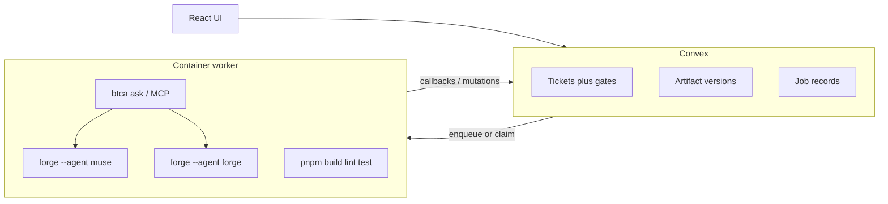

# Ticket AI Workflow — Phased Implementation Plan

## Current baseline

- Tickets live in Convex [`convex/schema.ts`](convex/schema.ts) with coarse statuses `BACKLOG → TEST_CASE → PLANNING → CODE_GENERATION → COMPLETED`.
- [`convex/tickets.ts`](convex/tickets.ts) exposes `move`, which advances or rewinds **without** approval gates, artifact storage, or jobs—this must be replaced or superseded.
- No actions, no HTTP routes beyond auth ([`convex/http.ts`](convex/http.ts)), no ForgeCode/BTCA integration yet.

## Target architecture

**Split of responsibilities**

| Concern | Where | Why |
|--------|--------|-----|
| Workflow rules, approvals, versioning, auth | Convex mutations/queries | Single source of truth, [`assertProjectAccess`](convex/utils/projectAccess.ts) already exists |
| Long-running ForgeCode, git, Docker, BTCA CLI | **External worker** (one container per job or pooled workers) | Convex actions are short-lived and cannot host Docker; generated commands need isolation |
| PR creation (post-validation) | Worker + Git provider API | Same isolation and secrets as codegen |

---

## Open product choices (defaults suggested)

- **AC generator**: same worker + structured LLM via Forge (`muse` with strict "output only Gherkin-style AC" prompt) *or* direct LLM API for speed; default to **Forge in container** for one toolchain.
- **PR host**: GitHub App vs PAT—plan assumes **GitHub** first; abstract `GitProvider` in worker if you need GitLab later.

---
---

# Phase 1 — Schema & Workflow Engine

> **Goal**: Lay the backend foundation — new tables, strict state machine, gate logic. No UI changes, no jobs yet.

### Scope

1. **Extend [`convex/schema.ts`](convex/schema.ts)**:
   - Add git fields on `projects` table: `gitRemoteUrl`, `defaultBranch`, `btcaProjectId` (all optional strings).
   - Stub tables **`artifactVersions`** and **`asyncJobs`** (define full schemas now, but mutations come in later phases).
   - **No separate gate table** — gate state is derived on-the-fly by querying `artifactVersions` (for approved AC/PLAN) and `validationRuns` (for validation status). This avoids dual-write complexity.

2. **New module [`convex/workflowEngine.ts`](convex/workflowEngine.ts)**:
   - Helper `canAdvance(ctx, ticketId, targetPhase): { allowed: boolean, reason?: string }` — queries `artifactVersions` to derive gate state:
     - `BACKLOG → TEST_CASE`: always allowed.
     - `TEST_CASE → PLANNING`: queries for an `artifactVersion` with `kind: "AC"` and `status: "approved"` for this ticket.
     - `PLANNING → CODE_GENERATION`: queries for an `artifactVersion` with `kind: "PLAN"` and `status: "approved"`.
     - `CODE_GENERATION → COMPLETED`: queries `validationRuns` for latest `overallStatus === "PASSED"` (stubbed as always-true for now).
   - Public mutation **`advancePhase({ ticketId, to })`**: validates access via `assertProjectAccess`, calls `canAdvance`, patches ticket status.
   - Public mutation **`rewindPhase({ ticketId, to })`**: allows moving backwards (deletes downstream artifact versions if desired, or just allows re-entry).

3. **Deprecate or narrow [`convex/tickets.ts`](convex/tickets.ts) `move`**:
   - Keep it working for existing tickets (migration path) but gate new usage through `advancePhase`.

### Key files

| Action | File |
|--------|------|
| MODIFY | [`convex/schema.ts`](convex/schema.ts) |
| NEW    | [`convex/workflowEngine.ts`](convex/workflowEngine.ts) |
| MODIFY | [`convex/tickets.ts`](convex/tickets.ts) |

### How to test

1. `npx convex dev` — schema deploys successfully.
2. In the Convex dashboard, create a ticket → verify it starts in `BACKLOG`.
3. Call `advancePhase` with `to: "TEST_CASE"` → succeeds.
4. Call `advancePhase` with `to: "PLANNING"` → **fails** with "AC not approved" (no artifact exists yet).
5. Call `rewindPhase` with `to: "BACKLOG"` → succeeds, ticket goes back.
6. Existing `move` mutation still works for backwards compatibility.

---

# Phase 2 — Artifact Versioning & Approval

> **Goal**: Full CRUD for artifact versions, approval mutations, and gate integration so `advancePhase` actually unblocks when artifacts are approved.

### Scope

1. **Finalize `artifactVersions` table schema** (from Phase 1 stub):
   - Fields: `ticketId`, `kind` (`"AC" | "PLAN" | "CODE"`), `version` (integer, auto-incremented per ticket+kind), `content` (string — markdown body), `userPrompt` (optional string), `parentVersionId` (optional self-reference), `createdByJobId` (optional, for Phase 3+), `status` (`"draft" | "approved" | "rejected"`).
   - Indexes: `by_ticketId_and_kind`, `by_ticketId`.

2. **New module [`convex/artifacts.ts`](convex/artifacts.ts)**:
   - `createArtifactVersion({ ticketId, kind, content, userPrompt?, parentVersionId? })` — inserts a new version, auto-increments version number, sets `status: "draft"`.
   - `approveArtifact({ versionId })` — patches `status: "approved"`. No separate gate table to update — `canAdvance` will pick this up automatically via its query.
   - `rejectArtifact({ versionId, reason? })` — patches `status: "rejected"`.
   - `listArtifactVersions({ ticketId, kind? })` — query, returns all versions ordered by version number desc.
   - `getArtifactVersion({ versionId })` — single document fetch.

3. **Wire gates into `workflowEngine.ts`**:
   - `canAdvance` now queries `artifactVersions` for approved versions (was stubbed in Phase 1). Since there's no gate table, this is just a query — no sync issues possible.

### Key files

| Action | File |
|--------|------|
| MODIFY | [`convex/schema.ts`](convex/schema.ts) — finalize `artifactVersions` |
| NEW    | [`convex/artifacts.ts`](convex/artifacts.ts) |
| MODIFY | [`convex/workflowEngine.ts`](convex/workflowEngine.ts) — real artifact queries |

### How to test

1. Create a ticket, advance to `TEST_CASE`.
2. Call `createArtifactVersion({ ticketId, kind: "AC", content: "## Given..." })` → row created with `version: 1, status: "draft"`.
3. Call `advancePhase({ to: "PLANNING" })` → **still fails** (draft, not approved).
4. Call `approveArtifact({ versionId })` → version status is now `"approved"`.
5. Call `advancePhase({ to: "PLANNING" })` → **succeeds**.
6. Create a second AC version → `version: 2`. Approve it. `canAdvance` still passes (it finds an approved AC).
7. Call `rejectArtifact` on v2 → status changes to `"rejected"`. `canAdvance` still passes because v1 is still approved.

---

# Phase 3 — Async Job Infrastructure + Secured HTTP

> **Goal**: Job queue system in Convex + secured HTTP callback endpoints so an external worker can claim jobs and report results. No actual worker yet — test with `curl` / Convex dashboard.

### Scope

1. **Finalize `asyncJobs` table schema** (from Phase 1 stub):
   - Fields: `ticketId`, `projectId`, `type` (`"GENERATE_AC" | "GENERATE_PLAN" | "GENERATE_CODE" | "VALIDATE" | "FIX_AFTER_FAILURE"`), `status` (`"queued" | "running" | "succeeded" | "failed" | "cancelled"`), `attempt` (number), `args` (object — flexible per job type), `result` (optional object), `error` (optional string), `artifactVersionId` (optional — output), `idempotencyKey` (string), `startedAt` / `finishedAt` (optional numbers).
   - Indexes: `by_status`, `by_ticketId`, `by_idempotencyKey`.

2. **New module [`convex/jobs.ts`](convex/jobs.ts)**:
   - Public mutation `enqueueJob({ ticketId, type, args, idempotencyKey? })` — inserts job with `status: "queued"`, validates no duplicate via idempotency key.
   - **Internal** mutation `claimNextJob({ type? })` — transaction: finds oldest `queued` job (optionally filtered by type), patches to `running`, returns full payload. Only callable internally.
   - **Internal** mutation `completeJob({ jobId, status, result?, error?, artifactVersionId? })` — patches job, handles side effects (create artifact version if result contains content, update gates).
   - Public query `listJobs({ ticketId })` — for UI progress display.
   - Public mutation `cancelJob({ jobId })` — sets `cancelled` if still `queued` or `running`.

3. **Mutation `requestRegeneration` in [`convex/workflowEngine.ts`](convex/workflowEngine.ts)**:
   - `requestRegeneration({ ticketId, phase, userPrompt })` — validates phase is current, no running job for this phase, then calls `enqueueJob`.

4. **Secured HTTP routes in [`convex/http.ts`](convex/http.ts)**:
   - `POST /worker/claim` → calls `claimNextJob` (validates HMAC or shared secret from `Authorization` header).
   - `POST /worker/complete` → calls `completeJob` (same auth).
   - Auth: use a `WORKER_SECRET` environment variable, worker sends it as `Bearer` token, HTTP action validates before calling internal mutations.

### Key files

| Action | File |
|--------|------|
| MODIFY | [`convex/schema.ts`](convex/schema.ts) — finalize `asyncJobs` |
| NEW    | [`convex/jobs.ts`](convex/jobs.ts) |
| MODIFY | [`convex/workflowEngine.ts`](convex/workflowEngine.ts) — `requestRegeneration` |
| MODIFY | [`convex/http.ts`](convex/http.ts) — worker callback routes |

### How to test

1. Call `enqueueJob({ ticketId, type: "GENERATE_AC", args: {} })` → job row with `status: "queued"`.
2. Call `enqueueJob` again with same `idempotencyKey` → rejected (no duplicate).
3. In Convex dashboard, run `claimNextJob` internally → returns the job, status now `running`.
4. Run `completeJob({ jobId, status: "succeeded", result: { content: "..." } })` → job marked `succeeded`.
5. `curl -X POST <CONVEX_URL>/worker/claim -H "Authorization: Bearer <WORKER_SECRET>"` → returns job payload (or empty if none queued).
6. `curl` the `/worker/complete` endpoint with a mock result → job completes.
7. Test with wrong/missing secret → **401 Unauthorized**.
8. Call `cancelJob` on a queued job → status becomes `cancelled`.

---

# Phase 4 — Basic Ticket Detail UI

> **Goal**: Build the ticket detail page with phase rail, artifact display, approve/reject/regenerate actions, and job status. Uses manually-created artifacts from Phase 2 — no worker integration yet. This lets you validate the entire UI flow before wiring up AI.

### Scope

1. **New route** — `/projects/:projectId/tickets/:ticketId` (or drawer/modal from workspace, your choice):
   - **Phase rail** (vertical stepper or horizontal tabs): shows all phases, highlights current, indicates gate status (locked 🔒 / unlocked 🔓 / completed ✅).
   - **"Advance" button**: calls `advancePhase`, disabled when gate is locked (with tooltip showing reason).
   - **"Rewind" button**: calls `rewindPhase` (with confirmation dialog).

2. **Artifact panel** (main content area when a phase is selected):
   - Renders the latest artifact version as **markdown**.
   - **Version dropdown**: switch between versions; show diff (text diff, unified or side-by-side) between any two selected versions.
   - **Actions**:
     - "Approve" → calls `approveArtifact`.
     - "Reject" → calls `rejectArtifact` (with optional reason modal).
     - "Regenerate" → opens modal with prompt textarea, calls `requestRegeneration`.
   - Shows `status` badge on each version (draft / approved / rejected).

3. **Job status panel** (sidebar or bottom bar):
   - `useQuery` on `listJobs({ ticketId })` — live-updating job list.
   - Status chips: queued (gray), running (blue pulse), succeeded (green), failed (red), cancelled (dim).
   - Expandable rows show `error` or `result` summary.

4. **Navigation**: add link from [`ProjectWorkspacePage`](src/pages/ProjectWorkspacePage.tsx) ticket cards to the detail page.

### Key files

| Action | File |
|--------|------|
| NEW    | `src/pages/TicketDetailPage.tsx` |
| NEW    | `src/components/tickets/PhaseRail.tsx` |
| NEW    | `src/components/tickets/ArtifactPanel.tsx` |
| NEW    | `src/components/tickets/JobStatusPanel.tsx` |
| MODIFY | `src/App.tsx` or router config — add route |
| MODIFY | [`src/pages/ProjectWorkspacePage.tsx`](src/pages/ProjectWorkspacePage.tsx) — link to detail |

### How to test

1. Navigate to a ticket detail page → phase rail shows all phases, current phase highlighted.
2. Manually create an artifact version (via dashboard or a temporary dev button) → it appears in the artifact panel as markdown.
3. Click "Approve" → badge changes to ✅, advance button becomes enabled.
4. Click "Advance" → phase moves forward, rail updates.
5. Click "Regenerate" → modal appears, submit enqueues a job, job status panel shows "queued".
6. Version dropdown shows all versions; switching versions re-renders content.
7. Click "Rewind" → confirmation dialog → phase moves back, downstream gates cleared.

---

# Phase 5 — Worker Container

> **Goal**: Build the external worker that polls Convex for jobs, runs ForgeCode/BTCA in a Docker container, and calls back with results. Test with a simple echo/mock job before wiring real AI.

### Scope

1. **New directory `worker/`** at repo root:
   - **`Dockerfile`**: base image (Debian/Ubuntu) + `git` + `curl` + Node.js + `pnpm` + [Bun](https://bun.sh) (BTCA requires it) + [`btca` CLI](https://docs.btca.dev/guides/quickstart) + [ForgeCode](https://forgecode.dev/docs/commands) install.
   - **`worker/src/index.ts`** (entrypoint, runs with Bun):
     - Job loop: `POST /worker/claim` → if job returned, process it → `POST /worker/complete`.
     - Configurable poll interval (e.g. 5s).
     - Graceful shutdown on SIGTERM.
   - **`worker/src/contextBundle.ts`**: builds a `ContextBundle` from job args — ticket fields, approved prior artifacts, BTCA Q&A pairs with **token budget** (truncate with explicit `[truncated]`).
   - **`worker/src/handlers/`**: one handler per job type (initially just a mock/echo handler for testing).

2. **Environment variables** the container needs:
   - `CONVEX_URL` — the deployment HTTP URL.
   - `WORKER_SECRET` — matches the Convex env var.
   - `ANTHROPIC_API_KEY` (or other provider keys) — for ForgeCode.
   - `BTCA_API_KEY` — if BTCA requires one.

3. **Non-interactive ForgeCode auth**: mount provider API keys via env vars; avoid `:login` in CI. Document `forge provider` non-interactive setup if available, else use pre-seeded config volume.

### Key files

| Action | File |
|--------|------|
| NEW    | `worker/Dockerfile` |
| NEW    | `worker/src/index.ts` |
| NEW    | `worker/src/contextBundle.ts` |
| NEW    | `worker/src/handlers/echo.ts` (mock handler for testing) |
| NEW    | `worker/package.json` |
| NEW    | `worker/.env.example` |

### How to test

1. `docker build -t synapse-worker ./worker` → builds successfully.
2. Enqueue a mock job in Convex dashboard (type: `"GENERATE_AC"`, or a test type).
3. `docker run --env-file worker/.env synapse-worker` → container starts, claims the job, runs echo handler, calls `/worker/complete`.
4. Verify in Convex dashboard: job status is `succeeded`, result contains echo data.
5. Stop container (Ctrl+C) → graceful shutdown, no orphaned jobs.
6. Test with wrong `WORKER_SECRET` → worker gets 401, logs error, retries with backoff.

---

# Phase 6 — AC Generation End-to-End (TEST_CASE Phase)

> **Goal**: Wire the first real AI phase — entering TEST_CASE triggers AC generation, the worker produces acceptance criteria via ForgeCode, and the user can view/approve/regenerate in the UI.

### Scope

1. **Auto-enqueue on phase entry**:
   - When `advancePhase` moves a ticket to `TEST_CASE`, auto-enqueue a `GENERATE_AC` job (idempotent — skip if one is already `queued`/`running` for this ticket+phase).

2. **Worker handler `worker/src/handlers/generateAC.ts`**:
   - Build bounded prompt from ticket title/description/type.
   - Call BTCA (`btca ask` against the indexed repo) for 1–3 focused questions (e.g. "modules likely touched", "existing test patterns") and inject **short** answers into the prompt — never full tree listings.
   - Run `forge --agent muse -p "..."` with strict system prompt: "Output only Gherkin-style acceptance criteria in markdown."
   - Parse output → call `/worker/complete` with content.

3. **`completeJob` side effect for `GENERATE_AC`**:
   - Auto-create an `artifactVersion` with `kind: "AC"`, content from result, link `createdByJobId`.
   - No gate table to update — the new draft version is automatically visible to `canAdvance` queries.

4. **Regenerate flow**:
   - User clicks "Regenerate" in UI → `requestRegeneration` enqueues new `GENERATE_AC` job with `userPrompt`.
   - Worker uses `userPrompt` as refinement context.
   - New artifact version created with `parentVersionId` pointing to previous version.

### Key files

| Action | File |
|--------|------|
| MODIFY | [`convex/workflowEngine.ts`](convex/workflowEngine.ts) — auto-enqueue on entry |
| MODIFY | [`convex/jobs.ts`](convex/jobs.ts) — `completeJob` side effects for AC |
| NEW    | `worker/src/handlers/generateAC.ts` |
| MODIFY | `worker/src/index.ts` — route `GENERATE_AC` to handler |

### How to test

1. Advance a ticket to `TEST_CASE` → job auto-enqueued (visible in UI job panel as "queued").
2. Worker claims and processes → job becomes "running" in UI.
3. Worker completes → artifact version appears in artifact panel with generated AC markdown.
4. Version shows `status: "draft"` badge.
5. Click "Approve" → gate unlocks, "Advance to Planning" button enables.
6. Click "Regenerate" with prompt "Add edge cases for empty input" → new job enqueued → new version appears with `version: 2`.
7. Version dropdown shows both versions; diff view works between v1 and v2.
8. Advance to PLANNING → succeeds.

---

# Phase 7 — Plan & Code Generation End-to-End

> **Goal**: Wire up PLANNING and CODE_GENERATION phases with the same pattern as Phase 6. Add the validation layer.

### Scope

#### 7A: Planning phase (`:muse`)

1. **Auto-enqueue `GENERATE_PLAN`** when entering `PLANNING`.
2. **Worker handler `worker/src/handlers/generatePlan.ts`**:
   - **Prompt pack**: ticket fields, **approved AC text** (fetched by version id from job args), user "extra context", and BTCA-grounded snippets (same bounded pattern as AC).
   - Run `forge --agent muse -p "..."`.
   - Capture muse output / `plans/` file, store as `artifactVersions` with `kind: "PLAN"`.
3. **Approval gate** mirrors AC — approve plan before advancing to `CODE_GENERATION`.

#### 7B: Code generation phase (`:forge`)

1. **Auto-enqueue `GENERATE_CODE`** with **approved plan version id** when entering `CODE_GENERATION`.
2. **Worker handler `worker/src/handlers/generateCode.ts`**:
   - Clone or update shallow git checkout (project's `gitRemoteUrl`, `defaultBranch`).
   - Checkout disposable branch `synapse/ticket-<id>-v<n>`.
   - Run `forge --agent forge -p "Implement the following plan: ..."` with plan text inlined.
   - System/developer instructions require: only changes consistent with the plan; list files touched; if plan is ambiguous, stop and note assumptions.
   - Store resulting **commit SHA + summary** in `artifactVersions` (`kind: "CODE"`). Prefer git refs + small metadata in Convex over large blobs.

#### 7C: Validation layer

1. **Auto-enqueue `VALIDATE`** after each successful `GENERATE_CODE`.
2. **Worker handler `worker/src/handlers/validate.ts`**:
   - In the same container (or slimmer CI image) with the generated diff applied.
   - Run `pnpm install --frozen-lockfile`, `pnpm run build`, `pnpm run lint`, then `pnpm test`.
   - Persist `validationRuns` table: step statuses and log excerpts.
3. **New table `validationRuns`** in schema: `jobId`, `ticketId`, `steps` (array of `{ name, status, logExcerpt }`), `overallStatus` (`"PASSED" | "FAILED"`).

### Key files

| Action | File |
|--------|------|
| MODIFY | [`convex/schema.ts`](convex/schema.ts) — `validationRuns` table |
| MODIFY | [`convex/workflowEngine.ts`](convex/workflowEngine.ts) — auto-enqueue for PLANNING & CODE_GEN |
| MODIFY | [`convex/jobs.ts`](convex/jobs.ts) — side effects for PLAN & CODE |
| NEW    | [`convex/validationRuns.ts`](convex/validationRuns.ts) — queries for validation data |
| NEW    | `worker/src/handlers/generatePlan.ts` |
| NEW    | `worker/src/handlers/generateCode.ts` |
| NEW    | `worker/src/handlers/validate.ts` |

### How to test

**7A — Planning:**
1. With an approved AC, advance to `PLANNING` → `GENERATE_PLAN` job enqueued.
2. Worker produces plan → artifact version appears with plan markdown.
3. Approve plan → advance to `CODE_GENERATION` succeeds.

**7B — Code generation:**
1. Advance to `CODE_GENERATION` → `GENERATE_CODE` job enqueued.
2. Worker clones repo, runs forge, produces code → artifact version with commit SHA + summary.
3. Artifact panel shows code summary and changed files.

**7C — Validation:**
1. After code generation succeeds → `VALIDATE` job auto-enqueued.
2. Worker runs build/lint/test → `validationRuns` row created.
3. If `PASSED` → validation badge shows green in UI.
4. If `FAILED` → badge shows red with expandable log excerpts.

---

# Phase 8 — Fix-after-Failure & PR Creation

> **Goal**: Close the loop — auto-fix failed validations with retry cap, and enable PR creation when all gates pass.

### Scope

1. **Fix-after-failure**:
   - When `VALIDATE` job completes with `FAILED` → auto-enqueue `FIX_AFTER_FAILURE` job.
   - Handler: run `forge` with a prompt containing the failing command output (bounded/truncated).
   - After fix → auto-enqueue another `VALIDATE`.
   - **Retry cap**: store `attempt` on jobs, cap at 3 (configurable). After max retries, mark the latest `validationRuns` row with a `blockedReason` or patch the ticket with a `needsIntervention` flag.

2. **PR creation**:
   - New mutation `requestPR({ ticketId })` — validates: code artifact approved + latest validation `PASSED`.
   - Enqueues `CREATE_PR` job.
   - Worker handler `worker/src/handlers/createPR.ts`:
     - Push the disposable branch to remote.
     - Use GitHub API (PAT or GitHub App) to open a PR with auto-generated title/body (ticket title, AC summary, plan summary, validation status).
   - On success → store PR URL on ticket, transition to `COMPLETED`.

3. **UI additions**:
   - "Open PR" button on ticket detail page — enabled only when code approved + validation passed.
   - PR link displayed after creation.
   - Validation panel: shows run history, step-by-step results, fix attempts.

4. **`canAdvance` update for `CODE_GENERATION → COMPLETED`**:
   - Now requires latest `validationRuns.overallStatus === "PASSED"` (was stubbed in Phase 1).

### Key files

| Action | File |
|--------|------|
| MODIFY | [`convex/workflowEngine.ts`](convex/workflowEngine.ts) — `requestPR`, real validation gate |
| MODIFY | [`convex/jobs.ts`](convex/jobs.ts) — fix-after-failure auto-enqueue, retry cap |
| NEW    | `worker/src/handlers/fixAfterFailure.ts` |
| NEW    | `worker/src/handlers/createPR.ts` |
| MODIFY | `src/pages/TicketDetailPage.tsx` — PR button, validation panel |

### How to test

1. Trigger a code generation that produces code with a lint error → validation `FAILED`.
2. `FIX_AFTER_FAILURE` job auto-enqueued → worker attempts fix → re-validates.
3. If fixed → validation `PASSED`. If not → retries up to 3 times → then `blockedReason` set.
4. With passing validation, click "Open PR" → PR created on GitHub, link appears in UI.
5. Ticket transitions to `COMPLETED`.
6. Verify full lifecycle: `BACKLOG → TEST_CASE (AC) → PLANNING (plan) → CODE_GENERATION (code + validation) → COMPLETED (PR)`.

---

## Consistency & control (applies to all phases)

- Single workflow module + tests for `canAdvance` / `canEnqueue`.
- All AI steps are **job-driven** with stored prompts and outputs (audit trail).
- PR creation is a **separate** explicit mutation/worker step after validation, not bundled into `forge` success.
- **One job per container** (simplest security/reproducibility) or **ephemeral workspace** per job on a shared worker with strong uid/gid isolation.

## Context management (BTCA + caps — applies to Phases 5–8)

- **Project settings**: link to git remote; optional BTCA project/repo id; "default questions" template.
- **Orchestrator** (worker TypeScript) builds a `ContextBundle`: ticket, approved prior artifacts by id, BTCA Q&A pairs with **token/size budget** (truncate with explicit `[truncated]`).
- **Never** pass full repo: rely on BTCA + plan file + diff summaries.

## Container image shape (Phase 5+)

- Base: Debian/Ubuntu + `git` + `curl` + [Forge install](https://forgecode.dev/docs/commands) + Node + `pnpm` + **Bun** (BTCA [requires Bun](https://docs.btca.dev/guides/quickstart)) + `btca` CLI.
- **Non-interactive auth**: mount provider API keys from orchestrator secrets (`ANTHROPIC_API_KEY`, etc.); avoid `:login` in CI.
- **One job per container** or ephemeral workspace per job on a shared worker.
